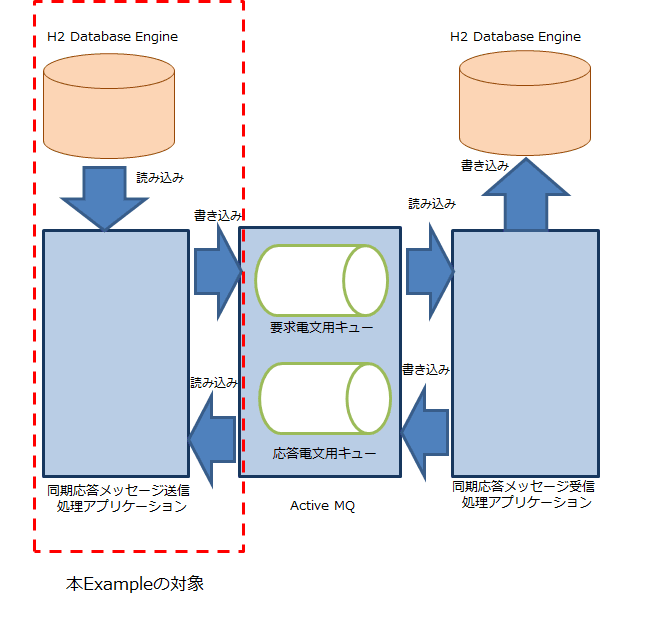

nablarch-example-mom-sync-send-batch
====================================

Nablarch FrameworkのMOM同期応答メッセージングの送信側のExampleです。
MOM同期応答メッセージングの受信側のExampleと組み合わせて使用します。

以下にメッセージングのシステムのうち、本Exampleが対象とする箇所を示します。



## 実行手順

### 1.動作環境
実行環境に以下のソフトウェアがインストールされている事を前提とします。
* Java Version : 17
* Maven 3.9.9以降

補足：
MOMは、MOM同期応答メッセージングの受信側のExampleに組み込まれたものを使用します。
RDBMSは、本Exampleに組み込まれたものを使用します。

### 2. プロジェクトリポジトリの取得
Gitを使用している場合、アプリケーションを配置したいディレクトリにて「git clone」コマンドを実行してください。
以下、コマンドの例です。

    $mkdir c:\example
    $cd c:\example
    $git clone https://github.com/nablarch/nablarch-example-mom-sync-send-batch.git

Gitを使用しない場合、最新のタグからzipをダウンロードし、任意のディレクトリへ展開してください。

### 3. アプリケーションのビルド
アプリケーションをビルドします。以下のコマンドを実行してください。

    $cd nablarch-example-mom-sync-send-batch
    $mvn package

実行に成功すると、以下のようなログがコンソールに出力されます。

    (中略)
    [INFO] ------------------------------------------------------------------------
    [INFO] BUILD SUCCESS
    [INFO] ------------------------------------------------------------------------
    (中略)

#### データベースのセットアップ及びエンティティクラスの作成について

アプリケーションを実行するためにはデータベースのセットアップ及びエンティティクラスの作成が必要ですが、これは`mvn package`の実行に含まれています。
この処理は`mvn generate-resources`で個別に実行することもできます。

※gspプラグインをJava 17で実行するためにはJVMオプションの指定が必要ですが、そのオプションは`.mvn/jvm.config`で指定しています。


### 4. アプリケーションの起動

先にMOM同期応答メッセージングの受信側のExampleを起動しておいてください。

以下のコマンドで、データベースの状態を最新化、MOM同期応答メッセージングの送信側のExampleが起動します。

    $mvn generate-resources
    $mvn exec:java -Dexec.mainClass=nablarch.fw.launcher.Main -Dexec.args="'-diConfig' 'messaging-sync-send-boot.xml' '-requestPath' 'SendProjectInsertMessageAction' '-userId' 'batch_user'"

なお、 `maven-assembly-plugin` を使用して実行可能jarの生成を行っているため、以下のコマンドでもアプリケーションを実行することが可能です。
    
    $java -jar target/application-<version_no>.jar -diConfig classpath:messaging-sync-send-boot.xml -requestPath SendProjectInsertMessageAction -userId batch_user

起動に成功すると、MOM同期応答メッセージングの受信側との通信を行い、以下のようなログがコンソールに出力されます。
ログ出力後、本Exampleは自動的に終了します。

```log
2023-02-15 13:30:08.479 -INFO- nablarch.fw.launcher.Main [null] boot_proc = [] proc_sys = [mom-sync-send-bat
ch] req_id = [null] usr_id = [null] @@@@ APPLICATION SETTINGS @@@@
        system settings = {
        }
        business date = [20140123]
2023-02-15 13:30:08.506 -INFO- com.nablarch.example.SendProjectInsertMessageAction [202302151330085060002] b
oot_proc = [] proc_sys = [mom-sync-send-batch] req_id = [SendProjectInsertMessageAction] usr_id = [batch_use
r] start
2023-02-15 13:30:09.178 -INFO- MESSAGING [202302151330085060002] boot_proc = [] proc_sys = [mom-sync-send-ba
tch] req_id = [SendProjectInsertMessageAction] usr_id = [batch_user] @@@@ SENT MESSAGE @@@@
        thread_name    = [pool-1-thread-1]
        message_id     = [ID:6e02d455-ace9-11ed-bf95-9c7befbbf589]
        destination    = [TEST.REQUEST]
        correlation_id = [null]
        reply_to       = [TEST.RESPONSE]
        time_to_live   = [0]
        message_body   = [ProjectInsertMessage0
プロジェクト００１

                                        development
                                                            s
                                                                                20100918201504091        鈴
木

                                      佐藤

                                                                              100      備考欄


                               10000    1000     2000     3000
]
2023-02-15 13:30:09.609 -INFO- MESSAGING [202302151330085060002] boot_proc = [] proc_sys = [mom-sync-send-ba
tch] req_id = [SendProjectInsertMessageAction] usr_id = [batch_user] @@@@ RECEIVED MESSAGE @@@@
        thread_name    = [pool-1-thread-1]
        message_id     = [ID:6e481b72-ace9-11ed-8a28-9c7befbbf589]
        destination    = [TEST.RESPONSE]
        correlation_id = [ID:6e02d455-ace9-11ed-bf95-9c7befbbf589]
        reply_to       = [null]
        message_body   = [ProjectInsertMessage0
success
]
2023-02-15 13:30:09.663 -INFO- nablarch.fw.handler.MultiThreadExecutionHandler [202302151330084800001] boot_
proc = [] proc_sys = [mom-sync-send-batch] req_id = [SendProjectInsertMessageAction] usr_id = [batch_user]
Thread Status: normal end.
Thread Result:[200 Success] The request has succeeded.
2023-02-15 13:30:09.665 -INFO- nablarch.core.log.app.BasicCommitLogger [202302151330084800001] boot_proc = [
] proc_sys = [mom-sync-send-batch] req_id = [SendProjectInsertMessageAction] usr_id = [batch_user] TOTAL COM
MIT COUNT = [1]
2023-02-15 13:30:09.669 -INFO- nablarch.fw.launcher.Main [null] boot_proc = [] proc_sys = [mom-sync-send-bat
ch] req_id = [null] usr_id = [null] @@@@ END @@@@ exit code = [0] execute time(ms) = [2659]
```

### 5. DBの確認方法

1. https://www.h2database.com/html/download.html からH2をインストールしてください。  

2. {インストールフォルダ}/bin/h2.bat を実行してください(コマンドプロンプトが開く)。  
  ※h2.bat実行中はExampleアプリケーションからDBへアクセスすることができないため、Exampleアプリケーションを停止しておいてください。

3. ブラウザから http://localhost:8082 を開き、以下の情報でH2コンソールにログインしてください。
   JDBC URLの{dbファイルのパス}には、`SAMPLE.h2.db`ファイルの格納ディレクトリまでのパスを指定してください。  
  JDBC URL：jdbc:h2:{dbファイルのパス}/SAMPLE  
  ユーザ名：SAMPLE  
  パスワード：SAMPLE
